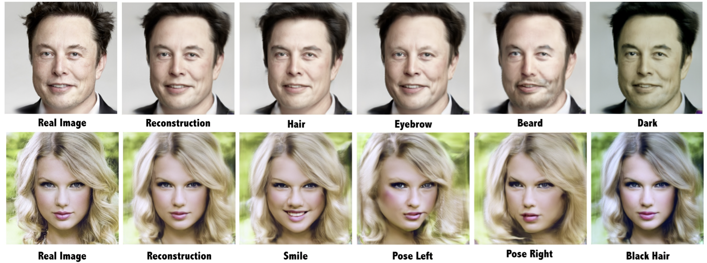

# 一个可以快速部署的真实人脸编辑方法 (简称RFM)

## 1.概述

这份代码做出以下三点贡献：

### 1.1 标签集
    
    - 对StyleGAN的潜码进行属性标记，用的是Nvidia的40个人脸属性分类器（40个神经网络预训练模型), 

    - 将顺序随机数的潜码z合成w再合成人脸进行标记。这里只保留z和label attributes （一个z对应一个人脸和40个attributes）

    - 暂时有PGGAN (seed 0-30,000), StyleGAN1 (seed 0-30,000), StyleGAN2也有在标注，有兴趣可以继续关注我们的工作！

### 2. 将真实图片映射到w 

    - 用了l2正则化将w拉的离原点近一些，大搞norm-l2 值在1000左右， 建议在500以上,1000左右)

    - 用了预训练的StyleGAN的编码器，执行文件参考: wy_gan_inversion.py, 配置文件参数在底部

### 3. 通过对标签集分类，在w中找到可用的编辑方向。

    - 这里用了逻辑回归LR分类器，加上L1正则，在有限的标签下效果较好(8,000左右属性标签).
    

## 2.使用细节

### 2.1 模型下载:

[百度云盘](https://pan.baidu.com/s/1rRd5q9qwGxfJkddLkxHy6Q?pwd=1989)

所有模型都在里面，注意参看配置文件放入对应文件夹 './checkpoint/'

### 2.2 标签集

- 参看文件'./checkpoint/label_dict/', 具体格式可以看 [标签集格式](./label_set_unit/readme_dict.md) 

- 潜码文件为'z_0_30000.pt', 有pytorch加载, 并用预训练模型生成w

- 如果想自己标记潜码，可以参看：'./label_set_unit/generation_seed_zw.py'，但是先下载预训练模型

- 我们的标签集：'stylegan1_attributes_seed0_30000.pt'

- 这里有一个用微软api做的标签集，在文件：'stylegan1_20307_attributes40_ms.pt'

    > 这个标签集有20307个样本，属性和用Nvidia 分类器标记的类似，具体格式也可以参看 [标签集格式](./label_set_unit/readme_dict.md) 
    
    > 我们做了一个针对ms标签集的清洗脚本参见：'./label_set_unit/label_set_ms/dict_ms_clean.py'

- 标记的潜码z，是seed_id固定的随机数，因此容易复现或者自己生成潜码，参见：'./label_set_unit/generation_seed_zw.py' 

### 2.3 怎么玩真脸编辑？

- 把真脸编入至潜码保存 (wy_gan_inversion.py)  

> 先下载预训练模型到 './checkpoint'

> 分别是 3 个 stylegan1 模型文件 到 './checkpoint/stylegan1/ffhq/'

> 一个编码器文件到 './checkpoint/stylegan1/E/'

> 将人脸图片放到 './checkpoint/real_imgs/'， 也可以参考‘wy_gan_inversion.py’文件末端的配置更改

> 也可以用我们提供的样例 [我们的真人潜码](./checkpoint/wy_faces/) .

-  得到对应标签属性的方向，参考以下两个文件，用sklearn可以很快得到8k样本的

> run 'wd_direction_ms.py'  Ms 标签集，注意同时下载原标签集和我们清洗的包（w和d）

> run 'wd_direction_nv.py'  我们的标签集

- 运行'rfm.py'去编辑人脸，

> 期间需要加载stylegan的预训练模型，两个潜码:人脸w_y和方向w_d

## 致谢(相关工作)

- GAN 编码器: https://github.com/disanda/MTV-TSA 

> 这个是我们之前的一个工作，可以高效的重构图像，主要是人脸，这份工作及文章有新的修订版将在未来更新。

- GAN encoder: https://github.com/Puzer/stylegan-encoder

> Ms的标签集来自这里

- Nvidia 人脸分类器: https://github.com/NVlabs/stylegan2/blob/master/metrics/linear_separability.py

- Baseline: 

> https://github.com/genforce/interfacegan

